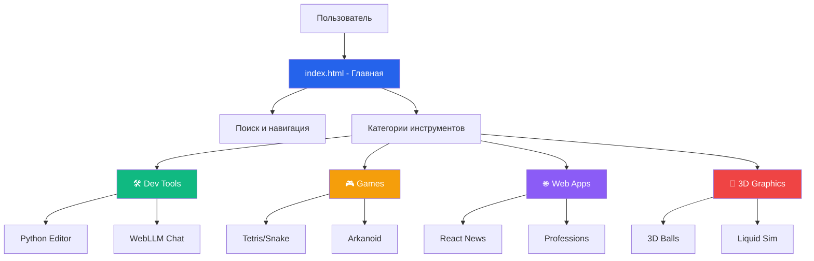

# Архитектурный документ AI Pages

**Версия:** 2.0  
**Дата:** Январь 2025  
**Автор:** Master Architect  
**Статус:** Консолидированный документ

---

## Введение

Этот документ описывает полную архитектуру проекта AI Pages - как концептуальную, так и реальное состояние кодовой базы.
Включает текущие паттерны, технический долг и руководство для AI-driven разработки.

**Тип проекта:** Коллекция самодостаточных HTML-приложений с центральной главной страницей  
**Ключевое ограничение:** Каждый инструмент должен быть полностью самодостаточным в одном HTML файле

---

## Быстрая справка - Ключевые файлы

### Критически важные файлы

- **Главный вход**: `index.html` (97KB, 1792 строки) - Центральный навигационный узел
- **Основные приложения**: 25+ самодостаточных HTML файлов
- **Тестовая инфраструктура**: `test_js/` (Playwright E2E), `tests/` (Python валидация)
- **CI/CD**: `.github/workflows/ci-cd.yml`

### Категории приложений

#### 🛠️ Инструменты разработки

- **`python_editor.html`** (152KB) - Python среда с Pyodide
- **`webllm-chat.html`** (48KB) - Локальный LLM интерфейс
- **`web-stable-diffusion.html`** (65KB) - ИИ генерация изображений

#### 🎮 Игры

- **`tetris.html`**, **`tetris-react.html`** - Классическая игра
- **`arcanoid_o3.html`** (39KB) - Арканоид в неоновом стиле
- **`snake.html`** (39KB) - Змейка с прогрессивной сложностью

#### 🌐 Веб-приложения

- **`react_news.html`** (54KB) - Агрегатор новостей на React
- **`professions.html`** (80KB) - Каталог профессий с поиском

#### 🎨 3D и графика

- **`3d_balls.html`** (33KB) - Физическая симуляция с Three.js
- **`mp3_effects.html`** (138KB) - Аудио визуализация

---

## Frontend Implementation Guidelines

### Coding Standards

- **JavaScript**: ES6+, camelCase функции, PascalCase классы, модульная структура
- **CSS**: Mobile-first, BEM naming, CSS переменные, Grid/Flexbox
- **HTML**: Семантическая разметка, ARIA атрибуты, валидная структура

### Архитектурные паттерны

- **Модульная структура**: App → Modules → Components
- **Publisher-Subscriber**: EventEmitter для связи между компонентами
- **Factory**: Создание UI компонентов по типу

### Testing Requirements

- **Playwright E2E**: Основная функциональность, responsive, accessibility
- **Unit тесты**: Встроенные в HTML для самодиагностики
- **Покрытие**: > 80% критических путей

### Security Best Practices

- **Input validation**: Проверка всех пользовательских входов
- **Sanitization**: Экранирование перед DOM вставкой
- **localStorage**: Namespace isolation, размер контроль
- **CSP Headers**: Content Security Policy для предотвращения XSS/injection

#### Content Security Policy Implementation

**Базовый CSP для большинства приложений:**

```html
<meta
  http-equiv="Content-Security-Policy"
  content="
  default-src 'self';
  script-src 'self' 'unsafe-inline' 'unsafe-eval' 
    https://cdn.jsdelivr.net https://unpkg.com https://cdnjs.cloudflare.com;
  style-src 'self' 'unsafe-inline' 
    https://cdn.jsdelivr.net https://cdnjs.cloudflare.com;
  img-src 'self' data: blob: https:;
  connect-src 'self' https: wss:;
  font-src 'self' https://cdnjs.cloudflare.com;"
/>
```

**Специфичные CSP по типам:**

- **Python/ML**: `worker-src 'self' blob: data:` для Pyodide
- **WebGL/3D**: `img-src 'self' data: blob:` для текстуры
- **React**: `script-src` включает `https://unpkg.com`

**XSS Protection Headers:**

- `X-Frame-Options: DENY`, `X-Content-Type-Options: nosniff`
- `Referrer-Policy: strict-origin-when-cross-origin`

### Performance Guidelines

- **Lazy Loading**: Тяжелые ресурсы загружаются по требованию
- **Memory Management**: Event listener cleanup, избегание утечек
- **Bundle Size**: < 200KB на HTML файл

### Development Checklist

- ✅ Semantic HTML структура
- ✅ Mobile-first CSS
- ✅ Error handling с fallback
- ✅ E2E тесты покрывают основной функционал
- ✅ Accessibility соответствие WCAG 2.1
- ✅ CDN зависимости с фиксированными версиями

### Component Templates Library

**11 готовых UI компонентов для AI агентов:**

1. **App Container** - основной контейнер с header/main/footer
2. **Button System** - primary/secondary/danger кнопки
3. **Card Component** - карточки контента с заголовками
4. **Form Components** - input/textarea/select элементы
5. **Grid System** - responsive сетка для макетов
6. **Modal Dialog** - всплывающие окна и диалоги
7. **Progress Bar** - индикаторы прогресса
8. **Navigation Tabs** - табы для переключения контента
9. **Loading Spinner** - анимация загрузки
10. **Alert Messages** - уведомления и сообщения
11. **Theme System** - стандартная система переключения темы

**Принципы:** Copy-paste ready, self-contained HTML+CSS+JS, responsive, WCAG 2.1

#### Стандартная система тем

**Общий стандарт для всех страниц проекта:**

**CSS переменные:**

```css
:root {
  --bg-color: #f4f4f4;
  --text-color: #333;
  --input-bg: #fff;
  --input-border: #ccc;
}

body.dark-theme {
  --bg-color: #1a1a1a;
  --text-color: #e0e0e0;
  --input-bg: #2d2d2d;
  --input-border: #555;
}
```

**HTML структура:**

```html
<!-- Кнопка настроек (фиксированная позиция) -->
<div class="settings-button" title="Настройки" tabindex="0">
  <i class="fas fa-cog"></i>
</div>

<!-- Модальное окно настроек -->
<div class="settings-modal" id="settingsModal" role="dialog" aria-labelledby="settingsTitle" aria-modal="true">
  <h3 class="settings-title" id="settingsTitle"><i class="fas fa-sliders-h"></i> Настройки</h3>
  <div class="settings-option">
    <label for="themeSwitch"> <i class="fas fa-moon"></i> Темная тема </label>
    <label class="toggle-switch">
      <input type="checkbox" id="themeSwitch" />
      <span class="slider"></span>
    </label>
  </div>
</div>
```

**Централизованная система настроек (aiPagesSettings):**

```javascript
// Библиотека aiPagesSettings - единая точка управления настройками
window.aiPagesSettings = {
  // Дефолтные значения настроек
  defaults: {
    theme: 'light',
    language: 'ru',
    view: 'grid',
  },

  // Получить значение настройки
  get(key) {
    const value = localStorage.getItem(key);
    return value !== null ? value : this.defaults[key];
  },

  // Установить значение настройки с автоприменением
  set(key, value) {
    localStorage.setItem(key, value);
    if (key === 'theme') {
      this.applyTheme();
    } else if (key === 'language') {
      this.applyLanguage();
    }
  },

  // Применить тему через data-theme атрибут
  applyTheme() {
    const theme = this.get('theme');
    document.documentElement.setAttribute('data-theme', theme);

    // Синхронизация UI элементов
    const themeSwitch = document.getElementById('themeSwitch');
    if (themeSwitch) {
      themeSwitch.checked = theme === 'dark';
    }
  },

  // Миграция с устаревших ключей localStorage
  migrate() {
    const oldTheme = localStorage.getItem('settings.darkTheme');
    if (oldTheme === 'true' && !localStorage.getItem('theme')) {
      localStorage.setItem('theme', 'dark');
      localStorage.removeItem('settings.darkTheme');
    }

    const audioTheme = localStorage.getItem('audioguide-theme');
    if (audioTheme && !localStorage.getItem('theme')) {
      localStorage.setItem('theme', audioTheme);
      localStorage.removeItem('audioguide-theme');
    }
  },

  // Инициализация
  init() {
    this.migrate();
    this.applyTheme();
    this.applyLanguage();
  },
};

// Инициализация при загрузке
window.aiPagesSettings.init();

// Обработчик переключения темы
document.getElementById('themeSwitch').addEventListener('change', () => {
  const theme = document.getElementById('themeSwitch').checked ? 'dark' : 'light';
  window.aiPagesSettings.set('theme', theme);
});
```

**Ключевые особенности новой системы:**

- **Централизованное управление**: Единая библиотека `aiPagesSettings` на всех страницах
- **Автоматическая синхронизация**: Изменения на одной странице мгновенно применяются везде
- **data-theme подход**: CSS переменные через `[data-theme="dark"]` селекторы вместо `body.dark`
- **Automatic migration**: Совместимость со старыми ключами `localStorage`
- **Единый API**: `get()`, `set()`, `applyTheme()`, `init()` методы
- **Framework агностик**: Работает с Vanilla JS, React, любыми компонентами

**Поддерживаемые страницы:**

- ✅ `index.html` - Главная навигационная страница (checkbox переключатель)
- ✅ `audio_guide.html` - Аудиогид с миграцией из `audioguide-theme`
- ✅ `professions.html` - Каталог профессий с миграцией из `settings.darkTheme`
- ✅ `python_editor.html` - Python редактор с React компонентом
- ✅ `python_editor_gradio.html` - Gradio версия Python редактора
- ✅ `react_news.html` - React приложение с кастомной интеграцией
- ✅ `webllm-chat.html` - WebLLM чат с темной темой по умолчанию
- ✅ `web-stable-diffusion.html` - Stable Diffusion с темной темой по умолчанию
- ✅ `precipitation_map.html` - Карта осадков OpenLayers с миграцией со старой системы

**Архитектурные паттерны:**

- **Micro-frontend подход**: Каждый HTML файл полностью автономен
- **Shared state через localStorage**: Общие настройки между приложениями
- **Progressive enhancement**: Graceful degradation при отсутствии библиотеки
- **Consistent UX**: Единые стили кнопок и модальных окон настроек

**Требования:**

- Автоматическая синхронизация через централизованную библиотеку `aiPagesSettings`
- Кнопка настроек всегда видна (fixed position) с едиными стилями
- Плавные переходы через CSS transitions
- Поддержка мобильных устройств
- Миграция с устаревших ключей `localStorage` без потери данных
- Единообразные FontAwesome иконки на всех страницах

### Development Principles

**SOLID:** Single Responsibility, Open/Closed, Liskov Substitution, Interface Segregation, Dependency Inversion  
**Качество:** DRY (не повторяйся), KISS (делай проще), YAGNI (не добавляй лишнего)  
**Clean Code:** Описательные имена, маленькие функции, комментарии объясняют "почему"

**Правила для AI Pages:**

- **HTML:** Самодостаточность, одно приложение на файл, читаемость для образования
- **JavaScript:** ES6+, const/let, модульная структура
- **CSS:** Mobile-first, CSS переменные, Grid/Flexbox
- **Безопасность:** Валидация входов, экранирование DOM, HTTPS только

**Метрики:** Покрытие тестами >80%, загрузка <2сек, размер HTML <200KB

### CI/CD Pipeline

**Workflow:** Push → Linting → Testing → Security → Performance → Deploy

**Этапы:**

1. **Linting**: ESLint, flake8, HTMLHint, Stylelint, Prettier
2. **Testing**: Python Playwright (основной), JavaScript Playwright (legacy)
3. **Quality Gates**: Accessibility WCAG 2.1, Security scan, Performance <200KB
4. **Deployment**: GitHub Pages автодеплой после прохождения всех проверок

**Команды:**

- `npm run lint` - все проверки качества
- `python -m pytest tests/` - E2E тесты
- `npx playwright test` - legacy JS тесты

**Блокирующие ошибки:** Синтаксис, accessibility, падение E2E тестов

#### Локальная среда разработки

**Проблема:** GitHub Actions проверяет больше файлов чем локальная среда, ошибки могут не проявляться локально.

**Решение - Pre-commit Hooks:**

- ✅ **Husky + lint-staged** настроены для автоматической проверки перед коммитом
- ✅ Проверяет все `playwright*.config.js` файлы (как в CI)
- ✅ Автоисправление форматирования
- ✅ Блокирует коммит при ошибках линтинга

**Команды локального воспроизведения CI:**

```bash
# Точная копия GitHub Actions
./scripts/ci-local.sh

# Отдельные проверки
npm run lint:js:ci      # JS линтинг как в CI
npm run lint:js:all     # Все playwright конфигурации
npm run pre-commit      # Ручной запуск pre-commit проверок
```

**Автоматическая настройка:**

```bash
npm install             # Автоматически настраивает pre-commit hooks
git commit -m "fix"     # ← Автоматическая проверка перед коммитом
```

**Принудительный коммит (не рекомендуется):**

```bash
git commit --no-verify -m "emergency commit"
```

---

## Высокоуровневая архитектура

### Техническое резюме

AI Pages использует **архитектуру микро-фронтенда** с полной изоляцией компонентов. Каждое приложение полностью
самодостаточно с встроенными CSS, JavaScript и зависимостями через CDN.

### CDN Dependencies Registry

**Принципы**: Зафиксированные версии, SRI integrity, fallback стратегии

| Категория       | Библиотека        | Версия       | Статус           | Файлы                                    |
| --------------- | ----------------- | ------------ | ---------------- | ---------------------------------------- |
| **UI & Icons**  | Font Awesome      | 5.15.4/6.4.0 | ✅ Зафиксировано | index.html, web-stable-diffusion         |
| **3D Graphics** | Three.js          | 0.158.0      | ✅ Унифицировано | mp3_effects, liquid_simulation, 3d_balls |
| **React**       | React/ReactDOM    | 18.x         | ✅ Унифицировано | react_news, tetris-react, python_editor  |
| **Charts**      | Chart.js          | 4.4.1        | ✅ Зафиксировано | professions.html                         |
| **Python**      | Pyodide           | 0.27.2       | ✅ Стабильно     | python_editor, gradio_lite               |
| **Maps**        | OpenLayers        | 7.5.2        | ✅ Фиксированная | precipitation_map                        |
| **Physics**     | Cannon.js         | 0.6.2        | ✅ Стабильно     | 3d_balls                                 |
| **Animation**   | GSAP              | 3.11.4       | ✅ Стабильно     | liquid_simulation                        |
| **Code Editor** | CodeMirror        | 5.65.0       | ✅ Стабильно     | python_editor                            |
| **Babel**       | @babel/standalone | Latest       | ✅ Стабильно     | React приложения                         |

**Критические исправления выполнены:**

- ✅ Chart.js зафиксирован с SRI integrity
- ✅ Three.js унифицирован на v0.158.0
- ✅ React мигрирован на v18 с новым API
- ✅ Все CDN ссылки проверены и стандартизированы

#### CDN Fallback Strategy

**Принцип:** Каждая критическая библиотека имеет минимум 2 источника

| Библиотека       | Основной CDN         | Fallback CDN         | Local Fallback    |
| ---------------- | -------------------- | -------------------- | ----------------- |
| **Three.js**     | cdn.jsdelivr.net     | unpkg.com            | ❌ Размер 680KB   |
| **React 18**     | unpkg.com            | cdn.jsdelivr.net     | ❌ Размер 160KB   |
| **Chart.js**     | cdn.jsdelivr.net     | cdnjs.cloudflare.com | ✅ Возможен 180KB |
| **Font Awesome** | cdnjs.cloudflare.com | cdn.jsdelivr.net     | ✅ Icons subset   |
| **Pyodide**      | cdn.jsdelivr.net     | pyodide.org          | ❌ Размер 350MB   |

**Реализация fallback:**

```javascript
// Пример для Chart.js
function loadChartJS() {
  const script = document.createElement('script');
  script.src = 'https://cdn.jsdelivr.net/npm/chart.js@4.4.1/dist/chart.min.js';
  script.onerror = () => {
    script.src = 'https://cdnjs.cloudflare.com/ajax/libs/Chart.js/4.4.1/chart.min.js';
  };
  document.head.appendChild(script);
}
```

**Критические библиотеки с local fallback:** Chart.js, Font Awesome Icons subset

### Высокоуровневая диаграмма



---

## Текущее состояние системы (Brownfield Analysis)

### Архитектурные паттерны (реальные)

1. **Самодостаточные компоненты** - все зависимости встроены или через CDN
2. **Прогрессивное улучшение** - работает без JS, улучшается интерактивными возможностями
3. **Mobile-first дизайн** - CSS Grid и Flexbox
4. **Интернационализация** - переключение языка в localStorage

### Технический долг

- **Смешанные версии библиотек** - ИСПРАВЛЕНО (унификация CDN)
- **Дублирование кода** - ~30% повторяющихся паттернов UI
- **Отсутствие единой системы компонентов** - ЧАСТИЧНО РЕШЕНО (Component Templates)

### Тестовое покрытие

- **E2E тесты**: 11 Playwright тестов (~75% критических путей)
- **Браузерная совместимость**: Chrome, Firefox, Safari
- **Адаптивность**: 6+ разрешений экрана
- **Доступность**: A11y проверки в каждом тесте

---

## Структура проекта

```text
AI-Pages/
├── index.html                     # Главная страница-навигатор
├── *.html                         # 25+ самодостаточных приложений
├── docs/                          # Архитектурная документация
├── test_js/                       # Playwright E2E тесты
├── tests/                         # Python валидация
├── validate_audio_guide/          # Специализированная валидация
├── .bmad-core/                    # BMad фреймворк v4
└── .github/workflows/             # CI/CD конфигурация
```

---

## Рекомендации для AI агентов

### Greenfield разработка (новые приложения)

1. Используйте `Component Templates Library` для UI
2. Следуйте `Frontend Architecture Guidelines`
3. Унифицированные CDN версии из `CDN Dependencies Registry`

### Brownfield улучшения (существующие)

1. Проверьте `ARCHITECTURE.md` на текущие паттерны
2. Используйте `architect-checklist` для аудита
3. Следуйте `linting` стандартам для качества кода

### Безопасность

- Все внешние ресурсы через HTTPS
- Валидация пользовательского ввода
- CSP заголовки для критических приложений
- SRI integrity для критических CDN (Chart.js, Font Awesome)

---

## Журнал изменений

| Дата       | Версия | Описание                             | Автор                |
| ---------- | ------ | ------------------------------------ | -------------------- |
| 2025-01-15 | 1.0    | Начальная архитектурная документация | Команда архитекторов |
| 2025-01-15 | 2.0    | Консолидация с Brownfield анализом   | BMad Master          |
